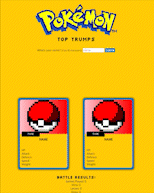

# Pokémon Top Trumps
This is a plain HTML, CSS, and JavaScript project spun off one of the early School of Code to learn the basics of  manipulating the DOM and API requests.

## Features
- 📡 Fetches pokemon from the PokéAPI based on name or ID number, and displays an image and a selection of that data on a CSS-generated "card;
- 🎲 Compares a stat chosen by the player, calculates who wins that round, and informs the player;
- ⚠️ Includes some basic error handling if the API cannot find the requested pokemon.

## Demo

## API
**[PokéAPI](https://pokeapi.co/):** All the Pokémon data you'll ever need in one place,
easily accessible through a modern RESTful API ([Documentation](https://pokeapi.co/docs/v2)).

## Tech Stack

## Lessons Learned
- Implemented some basic error handling; making sure everything didn't break if the API returned a 404. Something I want to keep investigating and developing in future projects because I feel this is fairly crude at the moment.

- Also learnt to proactively counter potential input "errors". One example would be the user correctly entering a Pokemon name with a capital letter, when that would return a 404 as they're stored lower case in the API.

- A reminder of how the callstack works when using async / await, as I initially had a few problems getting the cards to display the pokemon stats, since the display functions were being called before the promise had resolved.

## Future Improvements
- Improve the page layout, lots of blank space to start with, and results are hard to see down at the bottom;
- Improve the responsiveness of the page, as everything gets very tiny on mobiles;
- Show the computer's pokemon before announcing the result of the round;
- Use modals instead of alert boxes;
- Convert to a true Top Trumps type game, with the player getting dealt a hand of cards and choosing which of those to use, announcing the winner when all the cards are gone. Something to pursue in a React version?
